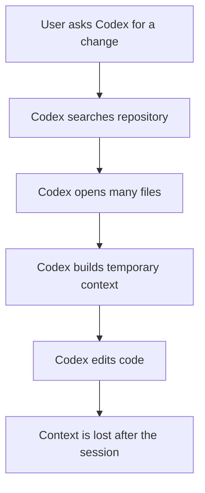
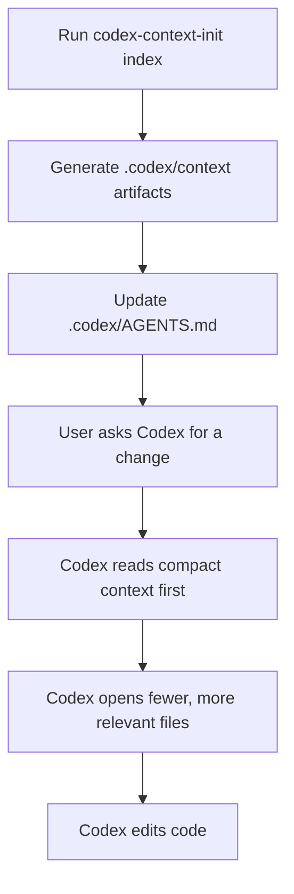
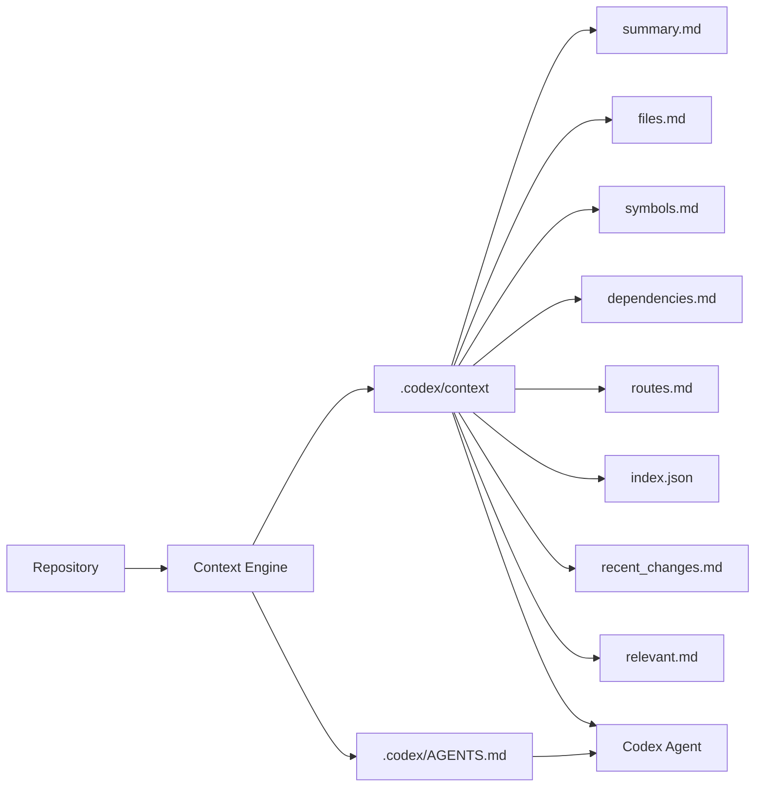

# Codex Token Saver

A local-first CLI + VS Code extension that prepares Codex with compressed repository context so it can search less, read fewer files, and start coding with better context.

Codex Token Saver is published as `codex-token-saver` and exposes the `codex-context-init` CLI command. It supports:

- CLI workflows
- VS Code extension commands
- Global Codex instructions in `~/.codex/AGENTS.md`
- Per-project `.codex/AGENTS.md`
- Precomputed `.codex/context` artifacts
- Deterministic query output in `.codex/context/relevant.md`

## Problem

AI coding agents often spend tokens rediscovering repository structure, reading unrelated files, and rebuilding context across sessions. That repeated exploration is useful, but it can be wasteful when the same project shape, files, symbols, dependencies, routes, and recent changes can be summarized ahead of time.

Codex Token Saver creates compact, local context files that Codex can read before doing broad repository search.

## Before



## After



## Architecture



## Key Features

- Shared core engine used by both CLI and VS Code
- Structured logging in `.codex/logs/latest.log`
- Atomic writes for generated context artifacts
- Global Codex token-saving rules
- Project-level `AGENTS.md` setup
- Context indexing
- Deterministic importance scoring
- File inventory
- Symbol extraction
- Dependency summary
- Route hints
- Recent git changes
- Context doctor
- Context clean
- Context query with `.codex/context/relevant.md`
- Debug diagnostics
- CLI + VS Code extension
- Local-only indexing
- Cross-platform support: Windows, macOS, Linux

## Installation

Install globally:

```sh
npm install -g codex-token-saver
```

Use locally during development:

```sh
npm install
npm link
```

Run the VS Code extension locally:

```sh
npm install
code .
```

Press F5 and choose `Run Extension` if prompted. In the Extension Development Host, open a test folder, then run `Codex Context` commands from the Command Palette.

## Quick Start

```sh
codex-context-init global
codex-context-init sync
codex-context-init index
codex-context-init doctor
codex-context-init context doctor
```

For task-specific narrowing after indexing:

```sh
codex-context-init query "what files handle authentication?"
```

## Recommended Workflows

### First-Time New Project

```sh
codex-context-init global
codex-context-init new my-app
cd my-app
codex-context-init index
codex-context-init doctor
```

### Existing Project

```sh
cd existing-repo
codex-context-init sync
codex-context-init project upgrade
codex-context-init index
codex-context-init query "what files are relevant to the change?"
codex-context-init context doctor
```

### VS Code

Run these from the Command Palette:

```txt
Codex Context: Setup Global Instructions
Codex Context: Sync Current Workspace
Codex Context: Index Current Workspace
Codex Context: Doctor Context Artifacts
Codex Context: Query Relevant Files
```

## Phase 1: Reliability Foundation

The CLI and VS Code extension are thin wrappers around shared core functions. Core logic returns structured result objects, while each surface decides how to display output.

Phase 1 includes:

- Shared engine modules for sync, index, doctor, upgrade, global setup, and query.
- Shared services for repository, context, and agent file operations.
- Shared logger with concise default output and verbose diagnostics.
- `.codex/logs/latest.log` for local troubleshooting.
- Atomic writes for generated context artifacts.
- Node built-in tests via `node --test`.

## Phase 2: Deterministic Indexing

The Context Engine uses deterministic heuristics only. It does not use embeddings, a vector database, or external APIs.

`index.json` includes:

- `schemaVersion`
- `generatedAt`
- `root`
- `fileCount`
- `languageCounts`
- `files`
- `importanceScore`
- `importanceReasons`

Each file entry can include:

- path, extension, size, and hash
- imports and exports
- symbols and headings
- route hints
- test hints
- parser metadata

The generated Markdown artifacts stay compact and are intended to guide Codex toward the smallest useful source file set.

## Phase 3: Context Query

After indexing, `codex-context-init query` reads only the existing `.codex/context/index.json`, applies deterministic scoring, and writes `.codex/context/relevant.md`.

`relevant.md` is a concise task-specific shortlist. It contains file paths, scores, reasons, and detected metadata such as symbols, routes, exports, and headings. It does not dump source code.

Example:

```sh
codex-context-init query "where is authentication handled?"
```

Use this before a focused Codex task when you want Codex to inspect a narrower set of files first.

## Command Reference

| Command | What it does | When to use it | Overwrites files? | Example |
| --- | --- | --- | --- | --- |
| `codex-context-init global` | Creates or updates global Codex token-saving instructions. | Once per machine. | Only managed block in `~/.codex/AGENTS.md`; preserves user content. | `codex-context-init global` |
| `codex-context-init global doctor` | Checks global `AGENTS.md` and managed block. | Debug global setup. | No. | `codex-context-init global doctor` |
| `codex-context-init new <project-name> [--force]` | Creates a new project with Codex context files. | Starting a new repo. | Skips existing files unless `--force` is passed. | `codex-context-init new my-app` |
| `codex-context-init sync` | Creates missing project files in the current repo. | Existing repo setup. | No. | `codex-context-init sync` |
| `codex-context-init doctor` | Checks required project files. | Verify project setup. | No. | `codex-context-init doctor` |
| `codex-context-init upgrade` | Updates project `.codex/AGENTS.md`. | Refresh project instructions. | Only managed block; preserves user content. | `codex-context-init upgrade` |
| `codex-context-init project doctor` | Alias for project doctor. | Explicit project checks. | No. | `codex-context-init project doctor` |
| `codex-context-init project upgrade` | Alias for project upgrade. | Explicit project upgrade. | Only managed block; preserves user content. | `codex-context-init project upgrade` |
| `codex-context-init index` | Generates `.codex/context` artifacts and upgrades project instructions. | Before asking Codex for project work. | Rewrites generated context artifacts only when changed. | `codex-context-init index` |
| `codex-context-init index --watch` | Watches files and re-indexes after changes. | Active development. | Same as `index`. | `codex-context-init index --watch` |
| `codex-context-init context doctor` | Validates context artifacts, `index.json`, file count, timestamp, AGENTS reference, and secret exclusions. | Debug generated context. | No. | `codex-context-init context doctor` |
| `codex-context-init context clean` | Deletes only `.codex/context`. | Rebuild context from scratch. | Deletes generated context directory only. | `codex-context-init context clean` |
| `codex-context-init query "<question>" [--top 10]` | Uses only the generated `index.json` to write `.codex/context/relevant.md` with the most relevant files. | Before a focused Codex task. | Writes generated `relevant.md` only. | `codex-context-init query "what files handle authentication?"` |
| `codex-context-init debug` | Prints OS, Node, CLI, AGENTS, context, and log diagnostics. | Debug local setup. | No. | `codex-context-init debug` |

## Generated Files

| File | Purpose |
| --- | --- |
| `~/.codex/AGENTS.md` | Global Codex token-saving instructions. |
| `.codex/AGENTS.md` | Project instructions that tell Codex to read generated context first. |
| `.codex/context/index.json` | Machine-readable index with schema version, file metadata, hashes, imports, exports, symbols, routes, test hints, and importance scores. |
| `.codex/context/summary.md` | Compact project overview. |
| `.codex/context/files.md` | Human-readable file map grouped by top-level folder. |
| `.codex/context/symbols.md` | Detected functions, classes, components, exports, and headings. |
| `.codex/context/dependencies.md` | Dependency files, package scripts, and dependency names. |
| `.codex/context/routes.md` | Heuristic route hints from framework and router patterns. |
| `.codex/context/recent_changes.md` | `git status --short` output when git is available. |
| `.codex/context/relevant.md` | Optional query-specific shortlist generated from `index.json`. |
| `.codex/logs/latest.log` | Latest local diagnostic log from CLI or extension operations. |
| `project_context.md` | User-maintained project goals and scope. |
| `architecture.md` | User-maintained architecture notes. |
| `task.md` | User-maintained current task context. |
| `decision_log.md` | User-maintained durable technical decisions. |

## VS Code Commands

| Command Palette item | Uses shared core logic | Output |
| --- | --- | --- |
| `Codex Context: Setup Global Instructions` | Yes | Notification |
| `Codex Context: Sync Current Workspace` | Yes | Notification |
| `Codex Context: Index Current Workspace` | Yes | Output Channel + notification |
| `Codex Context: Doctor Current Workspace` | Yes | Output Channel |
| `Codex Context: Doctor Context Artifacts` | Yes | Output Channel |
| `Codex Context: Query Relevant Files` | Yes | Output Channel + notification |
| `Codex Context: Upgrade AGENTS.md` | Yes | Notification |

## Expected Token Usage Improvements

Token savings vary by repository size, task type, and agent behavior. The biggest savings usually come from reducing repeated repository exploration. Small repositories may see modest gains; large repositories and monorepos may see more meaningful gains.

Rough estimates, not guaranteed benchmarks:

| Repository size | Possible reduction in context/tool exploration |
| --- | --- |
| Small repo | 5-15% |
| Medium repo | 15-35% |
| Large repo / monorepo | 25-50%+ |

## Safety

- Local-only indexing.
- No external API calls.
- Secret files are ignored, including `.env`, `.env.*`, `*.pem`, `*.key`, `id_rsa`, `id_ed25519`, `secrets.*`, and `credentials.*`.
- Large files are skipped.
- `sync` never overwrites existing files.
- Managed `AGENTS.md` blocks preserve user content outside markers.
- Query reads the generated `index.json` rather than scanning source files.
- Context artifacts are written atomically.
- `context clean` deletes only `.codex/context`.

## Limitations

- Heuristic parser.
- Not a vector database.
- No embeddings in v1.
- Not direct runtime injection into Codex.
- Source code remains source of truth.
- Generated context can become stale unless re-indexed.
- Query quality depends on the existing index and deterministic heuristic scoring.

## Troubleshooting

Check project setup:

```sh
codex-context-init doctor
```

Check generated context:

```sh
codex-context-init context doctor
```

Rebuild generated context:

```sh
codex-context-init context clean
codex-context-init index
```

Use `codex-context-init debug` for local diagnostics. Use `--verbose` with CLI commands for stack traces when debugging command failures.

Inspect the latest local log:

PowerShell:

```powershell
type .codex\logs\latest.log
```

macOS/Linux:

```sh
cat .codex/logs/latest.log
```
